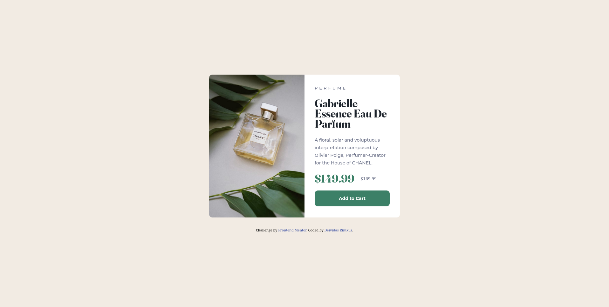

# Frontend Mentor - Product preview card component solution

This is a solution to the [Product preview card component challenge on Frontend Mentor](https://www.frontendmentor.io/challenges/product-preview-card-component-GO7UmttRfa). Frontend Mentor challenges help you improve your coding skills by building realistic projects.

## Table of contents

- [Overview](#overview)
  - [The challenge](#the-challenge)
  - [Screenshot](#screenshot)
  - [Links](#links)
- [My process](#my-process)
  - [Built with](#built-with)
  - [What I learned](#what-i-learned)
  - [Useful resources](#useful-resources)
- [Author](#author)

## Overview

### The challenge

Users should be able to:

- View the optimal layout depending on their device's screen size
- See hover and focus states for interactive elements

### Screenshot




### Links

- Solution URL: [GitHub](https://github.com/Lisviks/product-preview-card-frontendmentor.git)
- Live Site URL: [Add live site URL here](https://your-live-site-url.com)

## My process

### Built with

- Semantic HTML5 markup
- CSS custom properties
- Flexbox
- Mobile-first workflow

### What I learned

To use CSS variables.

```css
:root {
  --main: #000;
}

.body {
  color: var(--main);
}
```

How to add an image to a div with CSS.

```html
<div class="image"></div>
```

```css
.image {
  content: url('./image.url');
}
```

### Useful resources

- [CSS Variables](https://developer.mozilla.org/en-US/docs/Web/CSS/Using_CSS_custom_properties#using_the_root_pseudo-class) - This helped me to use CSS variables.
- [Add image using CSS](https://stackoverflow.com/questions/10829675/how-to-put-an-image-in-div-with-css) - This helped me with adding image using CSS and later change it based on screen size.

## Author

- Website - [Deividas Rimkus](https://github.com/Lisviks)
- Frontend Mentor - [@Lisviks](https://www.frontendmentor.io/profile/Lisviks)
- Twitter - [@DRimkusDev](https://twitter.com/DRimkusDev)
